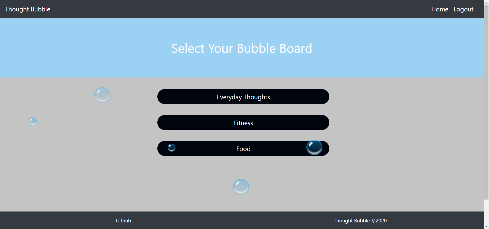
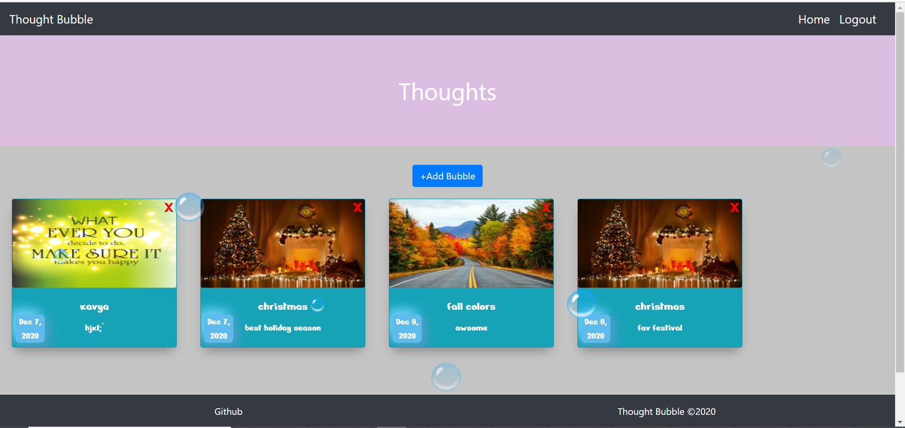

    

# ThoughtBubble

# Application Does:
* This is a full-stack Journal application developed using the MERN tech stack. User can save ativities and pictures in to there own account from local computer.

# Technologies used:
* MERN(MongoDB, Express js, React, Node js)
* CSS , Bootstrap
* Cloudinary, Multer
* Neumorphism

# Features
* Digital Journal
* User can create personal account
* Save memories in digital form
* Save pictures
* Delete the journal activity
* Show date of the activity created
* Using Cloudinary and Multer

# Sample web page

 
 
# Heroku
 https://thought-bubble-0.herokuapp.com/

# Github repository
 https://github.com/cristinaruiz21/ThoughtBubble

# Contributing
  *m_aguilar_2011@yahoo.com
    *satyakavya24@gmail.com
    *cristinaruiz96@yahoo.com
    *drod18@hotmail.com
    *devinamccomb@gmail.com

@copyright 2020
